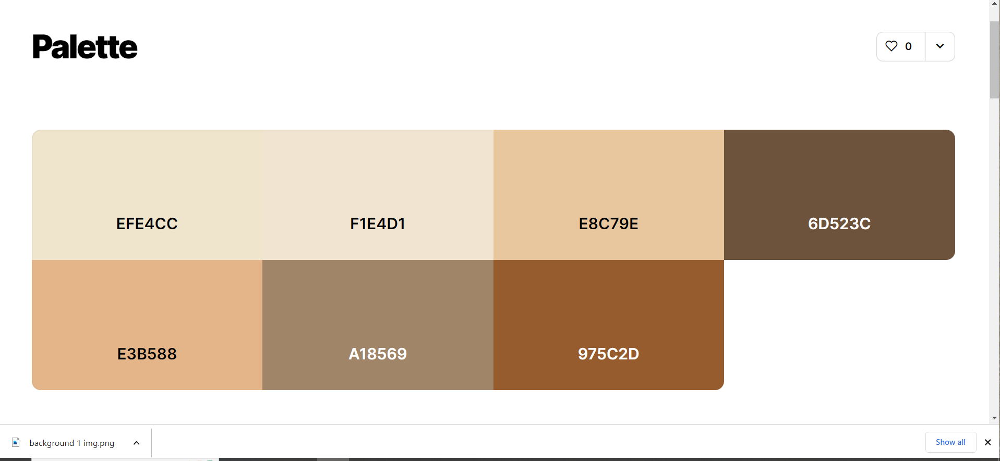
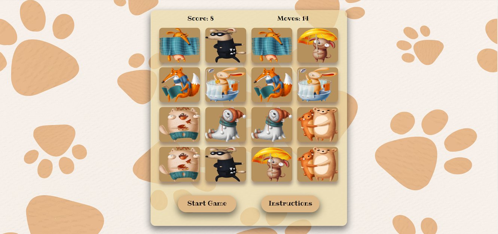
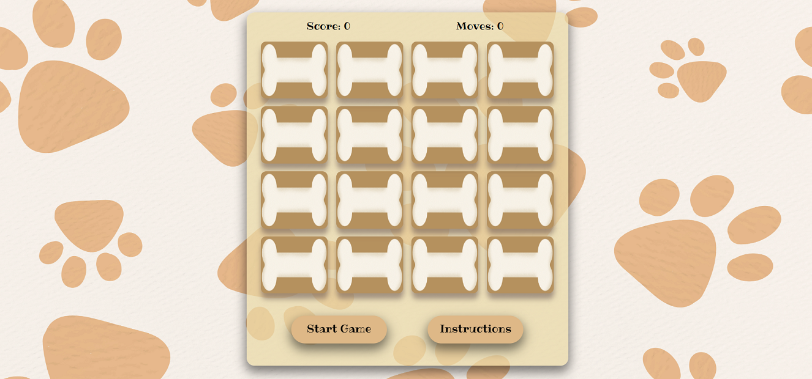

# **_Funny Dogs Memory Game_**

The Funny Dogs Memory Game is a simple matching cards game in which all the cards are flipped backside on a surface. 
There are 8 cards that have the same images, but each card is placed randomly, and the user's mission is to find them. It is possible to flip up with only two cards over each turn. 
The game doesn't have a time limit to find the pairs of cards.

Due to the low level of difficulty, the game is intended for younger users,to entertain and at the same time improve memory; however adults can also play it. 

Throughout the creation of this game, I was using three HTML ( index.html, welcome.html, instruction.html) two CSS files (game.css, style.css), and one java.js file.
[View the live project here.](https://kamilaazul.github.io/FunnyDogsMemoryGame/index.html)  

# Contents

* [**User Experience UX**](<#user-experience-ux>)
    * [Site Structure](<#site-structure>)
    * [Design Choices](<#design-choices>)
    * [Typography](<#typography>)
    * [Colour Scheme](<#colour-scheme>)

* [**Features**](<#features>)
   * [Welcome Page](<#welcome-page>)
   * [Instruction Page](<#instruction-page>)
   * [Memory Game Page](<#memory-game-page>)
* [**Technologies Used**](<#technologies-used>)
* [**Testing**](<#testing>)
* [**Deployment**](<#deployment>)
* [**Credits**](<#credits>)
    * [**Content**](<#content>)
    * [**Media**](<#media>)
*  [**Acknowledgements**](<#acknowledgements>)
        
# User Experience (UX)

## Site Structure

The Funny Dogs Memory Game website has three pages. The [welcome page](index.html) is the default loading page, [instructions](info.html), [game](game.html).

[Back to top](<#contents>)

## User Stories

- As a user I want to be able to navigate through the whole site smoothly.
- As a user I want to understand the purpose of the site upon loading it.
- As a user I want to understand the rules of the game.
- As a user I want to play the game with no technical problems.

[Back to top](<#contents>)

## Design-choices
 * ### Typography
      * The fonts chosen were 'Ribeye'.
 * ### Colour Scheme
      The color scheme chosen for the project is warm colors in shades of brown, beige, and cream.

      

[Back to top](<#contents>)

## Existing Features  
### Welcome Page

 * The first-page purpose is welcome a user and as well to give two options: 
      - to start the game,
      - to get to know the instructions of the game.

After clicking a _Start Game_ button the user will be transferred to a memory game page. 

After clicking the _Instructions_ button the user will be transferred to an instructions page. 

[Back to top](<#contents>)

### Instruction Page

This page will give a user an explanation of the rules of the game and will give a two option:

-  to go back to the first page by clicking a _Welcome Page_,
-  to the Memory card page by clicking _Start Game_ where you can start the game.

[Back to top](<#contents>)

## Memory Game Page

This page contains sixteen randomly arranged cards, eight matching pairs, as we need two of each picture.  

* The memory card container with card facing forward

* The memory card container with card facing backwards 

- The moves counter helps to track of how many moves the player has made.
- The score shows how many correct answers the player has at the moment.

[Back to top](<#contents>)

## Technologies Used
* `HTML` provides the content and structure for the website.
* `CSS` provides the styling.
* `JavaScript` to create dynamically updating content.
* [Gitpod](https://www.gitpod.io/#get-started) - used to deploy the website.
* [Github](https://github.com/) - used to host and edit the website.

[Back to top](<#contents>)

## Testing

Please refer to [**_here_**](TESTING.md) for more information on testing.

[Back to top](<#contents>)

## Deployment

## Forking the GitHub Repository
By forking the GitHub Repository we make a copy of the original repository on our GitHub account to view and/or make changes without affecting the original repository by using the following steps...

1. Log in to GitHub and locate the GitHub Repository.
2. At the top of the Repository (not top of page) just above the "Settings" Button on the menu, locate the "Fork" Button.
3. You should now have a copy of the original repository in your GitHub account.
 

## Making a Local Clone
1. Log in to GitHub and locate the GitHub Repository.
2. Under the repository name, click "Clone or download".
3. To clone the repository using HTTPS, under "Clone with HTTPS", copy the link.
4. Open Git Bash.
5. Change the current working directory to the location where you want the cloned directory to be made.
6. Type git clone, and then paste the URL you copied.
 

## Github Pages
The site was deployed to GitHub page. To deploy our project, we need to make the following steps:
1. Find the GitHub repository of the project we want to deploy.
2. Click on the Settings. The button we can find on the far right side of the menu.
3.  Scroll down and click on the Pages section.
4.  Under Source, select "main" in the dropdown menu.
5. Click Save and the page should refresh automatically.
6.  To confirm deployment the information will appear:  "Your site is ready to be published at  https://kamilaazul.github.io/FunnyDogsMemoryGame/".

[Back to top](<#contents>)

# Credits
### Content

* The font came from [Google Fonts](https://fonts.google.com/).
* The code for organizing the Memory Game Page and styling was inspired by an example on  [YouTube tutorial](https://www.youtube.com/watch?v=6ohVH0hQlD8).
* The Javascript code for the Game Page was inspired by an example on  [YouTube tutorial](https://marina-ferreira.github.io/tutorials/js/memory-game/).
* The Javascript code for *the shuffle cards function* of the Memory Game was inspired by an example on  [YouTube tutorial](https://www.youtube.com/watch?v=1G6MwIy-7Yc).
* The inspiration for the Readme file came from this repository on [GitHub](https://github.com/EwanColquhoun/wawaswoods/blob/master/README.md).

### Media
* The photos for the front cards came from [Creative Fabrica](https://www.creativefabrica.com/)
* The photos for the back cards and background comes from [Feepick](https://pl.freepik.com/)

[Back to top](<#contents>)

## Acknowledgements

The website was completed as a Portfolio Project 2 JavaScript Essentials Project made for the Full Stack Software Developer (e-Commerce) Diploma at the [Code Institute](https://codeinstitute.net/). 

I would like to thank my mentor [Precious Ijege](https://www.linkedin.com/in/precious-ijege-908a00168/), the Slack community, and all at the Code Institute for their help and support.

[Back to top](<#contents>)

