# Testing

## Code Validation

The Lighthouse, W3C Markup Validator, JSHint and the Lighthouse report were used to determine whether there were any
errors in the code:

* [W3C html Validator](https://validator.w3.org/), 
* [W3C CSS Validator](https://jigsaw.w3.org/css-validator/),
* [Jshint validator](https://jshint.com/),
* Lighthouse report,

## [W3C html Validator](https://validator.w3.org/)

The HTML validator results for each page are below:

#### Welcome Page:
- No errors or warnings to show.
#### Instruction Page:
- No errors or warnings to show.
#### Game Page:
- Some errors and warining were detected and were solved.
Not solved waringin are not affecting the operation of the site.
* Unclosed Elements,
* End of HTML
Closing tags for the *section* and *body* elements are missing. Add them at the end of your HTML code:
Correction of this error was made.

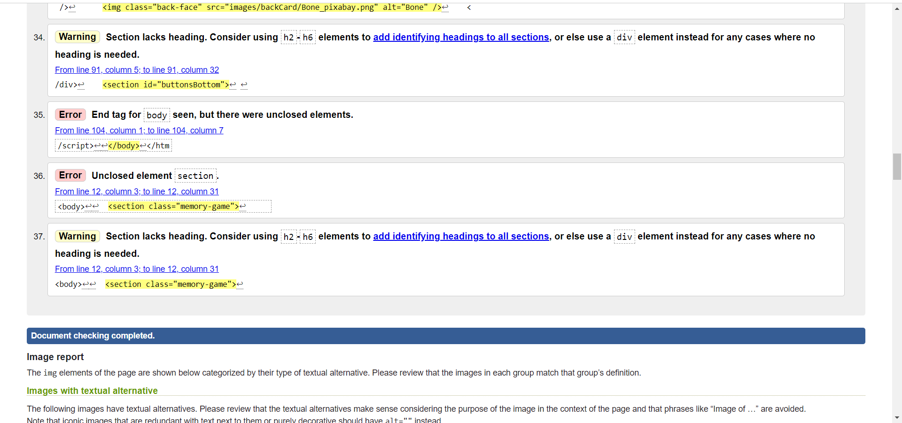

#### Congratulation Page:
- No errors or warnings to show.

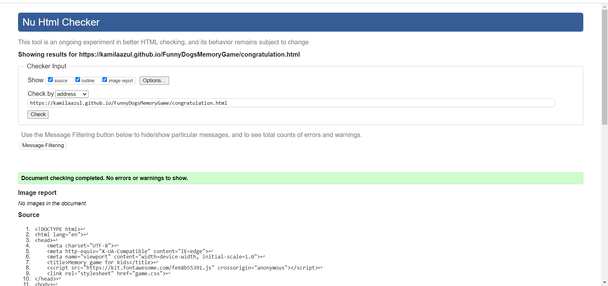
 

## [Jshint validator](https://jshint.com/)

There are 10 functions in this file.

Function with the largest signature take 1 arguments, while the median is 0.

Largest function has 23 statements in it, while the median is 2.

The most complex function has a cyclomatic complexity value of 7 while the median is 1.

17 warnings
1	'const' is available in ES6 (use 'esversion: 6') or Mozilla JS extensions (use moz).
2	'const' is available in ES6 (use 'esversion: 6') or Mozilla JS extensions (use moz).
3	'const' is available in ES6 (use 'esversion: 6') or Mozilla JS extensions (use moz).
4	'const' is available in ES6 (use 'esversion: 6') or Mozilla JS extensions (use moz).
8	'let' is available in ES6 (use 'esversion: 6') or Mozilla JS extensions (use moz).
9	'let' is available in ES6 (use 'esversion: 6') or Mozilla JS extensions (use moz).
10	'let' is available in ES6 (use 'esversion: 6') or Mozilla JS extensions (use moz).
11	'let' is available in ES6 (use 'esversion: 6') or Mozilla JS extensions (use moz).
48	'template literal syntax' is only available in ES6 (use 'esversion: 6').
60	'arrow function syntax (=>)' is only available in ES6 (use 'esversion: 6').
61	'const' is available in ES6 (use 'esversion: 6') or Mozilla JS extensions (use moz).
61	'template literal syntax' is only available in ES6 (use 'esversion: 6').
62	'template literal syntax' is only available in ES6 (use 'esversion: 6').
68	'arrow function syntax (=>)' is only available in ES6 (use 'esversion: 6').
75	'arrow function syntax (=>)' is only available in ES6 (use 'esversion: 6').
84	'arrow function syntax (=>)' is only available in ES6 (use 'esversion: 6').
119	'let' is available in ES6 (use 'esversion: 6') or Mozilla JS extensions (use moz).

* Script.js

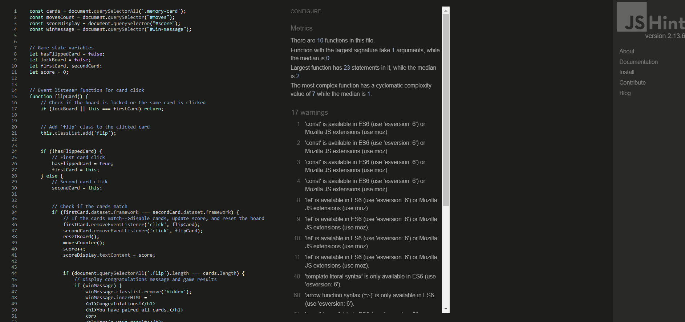

* Congratulations Page

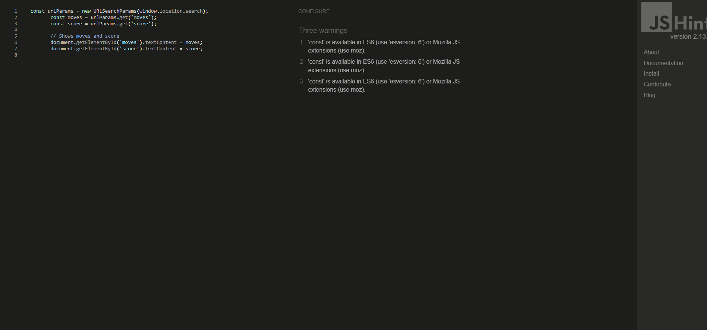

[Back to top](<#testing>)

## [W3C CSS Validator](https://jigsaw.w3.org/css-validator/)

There are two css file: game.css and styling.css

* game.css had one error, which was corrected and at the moment there are no errors detected.
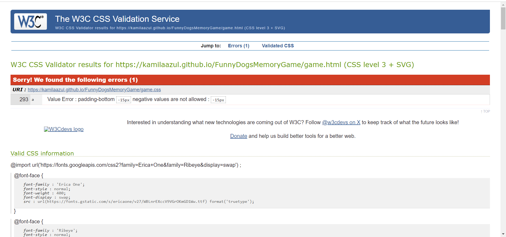

* styling.css has no errors.

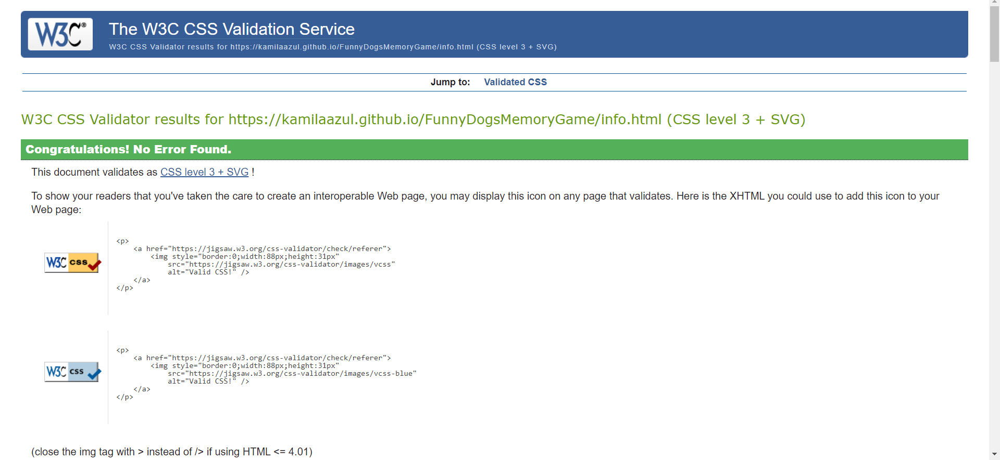

## Lighthouse report

Welcome Page
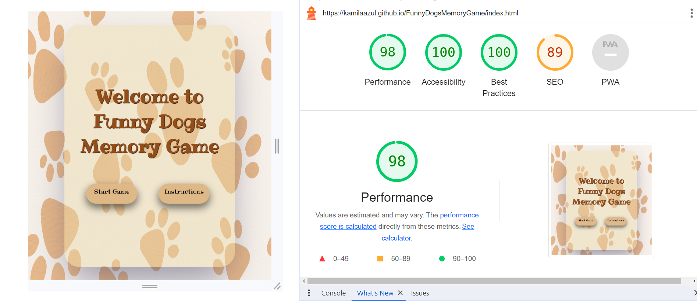
Instructions Page
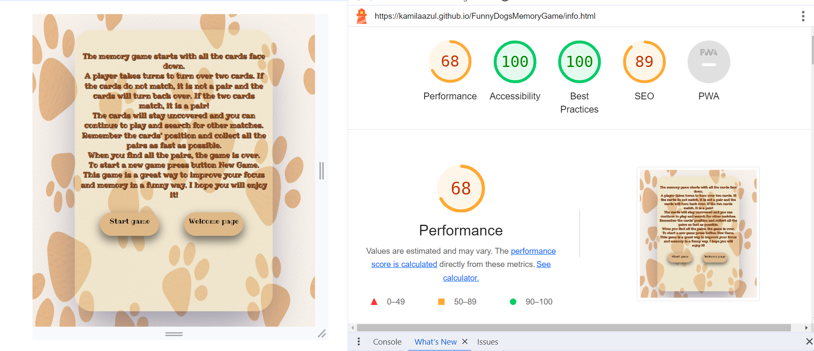
Game Page
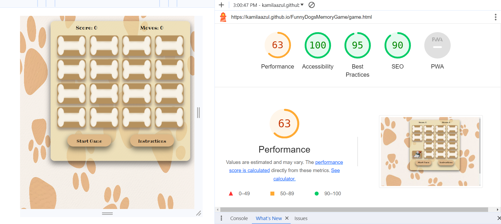
Congratulations Page
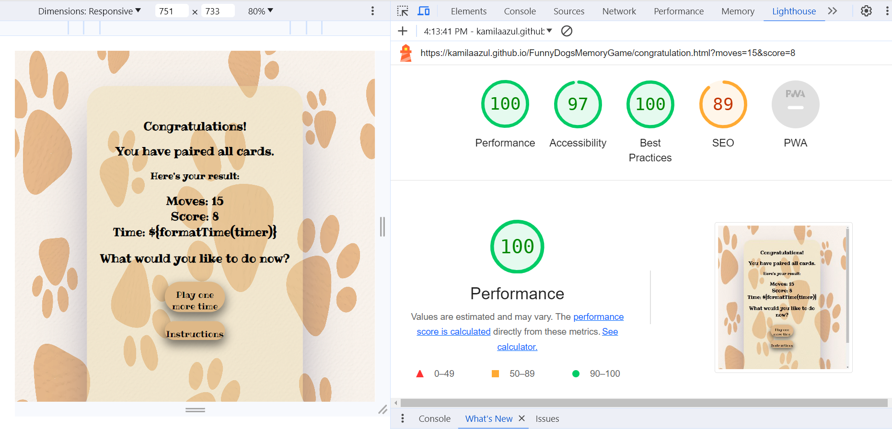

## Console Testing

* Solved bugs:
A console error is generated each time the first card is flipped.
 
* There are no error in console at the moment.
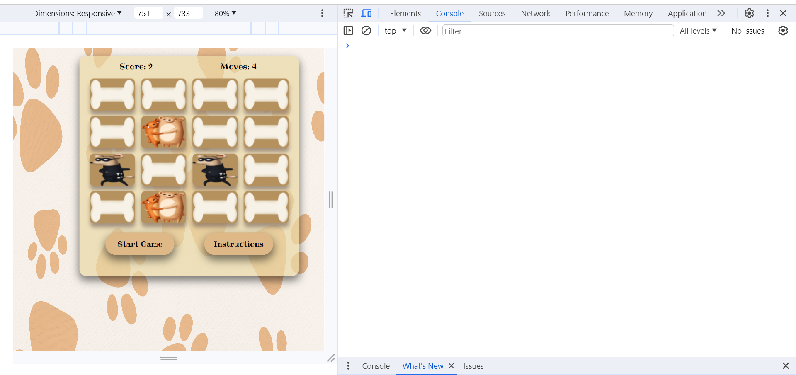

### Responsiveness Test

* The responsive design tests were carried out manually with [Responsive Design Checker](https://www.responsivedesignchecker.com/).
The website has adequate responsiveness on all screen sizes.

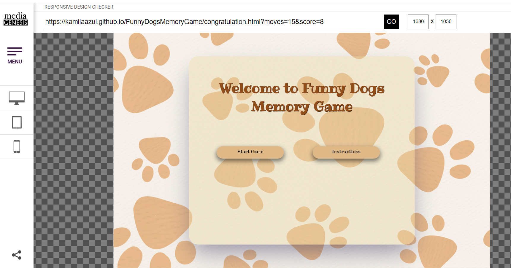
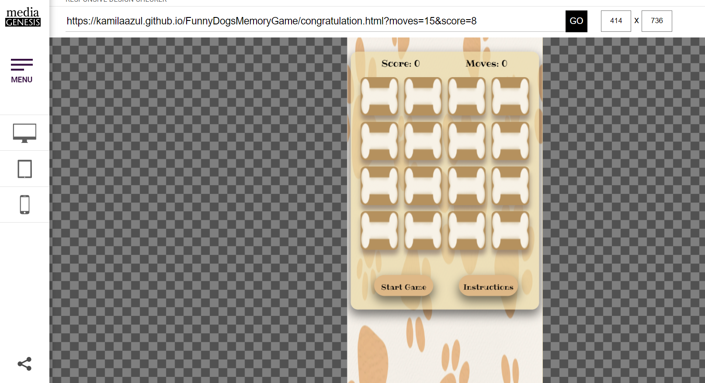
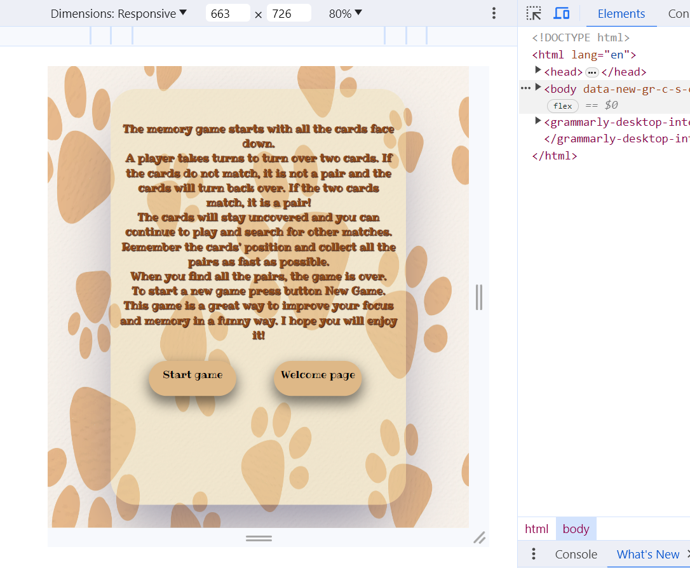

[Back to top](<#testing>)

## Testing the User Stories

- As a user I want to be able to navigate through the whole site smoothly.
* The user can move freely around the website.
All pages are connected and it's easy to go to the next page or go back to the previous page. Using the website is easy and clear for the user.
- As a user I want to understand the purpose of the site upon loading it.
* The purpose of the website is clear and understandable to the user.
The website contains a detailed description of what this website is for.
- As a user I want to understand the rules of the game.
* The user enters the "Instructions" page and will find a description and rules of the game.
- As a user I want to play the game with no technical problems.
* The user does not encounter any technical problems while playing.
All game functions work properly.

[Back to top](<#testing>)

## Manual testing

All pages were manually tested. On every page there are two buttons.

#### Welome Page
- Start Game Button - working well
- Instruction Game Button- working well
#### Instruction Page
- Start Game Button - working well
- Welcome Page Button- working well
#### Memory Game Page
- Start Game Button - working well
- Instruction Game Button- working well
 - The score- working correctly. Whenever two cards are paired the score changes.
 - The movements count- Working well. Whenever the user uncovers two cards one number is added to the moves number.
 - Cards- cards are working correctly. They are turning whenever are clicked. When cards are paired they stay uncovered until all cards are paired and only then do they all turn again showing the front.
#### Congratulation Page
- Play One More Time Button - working well
- Instruction Game Button- working well
- The score number is showing accordingly.
- The moves number is showing accordingly.

## Known Bugs

- The are now known bugs.

[Back to top](<#testing>)

